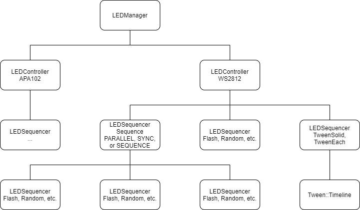

# FastLEDManager

My FastLED Manager that can generate multiple sequences with layered (mixed) output

## Features

- Multiple led sequence generation
- Layered (mixed) output
- External pixel assignment
- Overwrite output
- Auto multi-core (ESP32)
- (TODO) Divide one LED stripe into several parts

## Dependencies

- [FastLED](https://github.com/FastLED/FastLED)
- [TaskManager](https://github.com/hideakitai/TaskManager)
- [Tween](https://github.com/hideakitai/Tween)
- [DebugLog](https://github.com/hideakitai/DebugLog)
- [GammaTable](https://github.com/hideakitai/GammaTable)

## Overview

### Structure

This library is consists of three classes:

- `LEDManager` has multiple `LEDController` and manages access to them (singleton)
- `LEDController` has `CLEDController` and `CRGBArray<N>` to control each led strip
  - `LEDController` also has `LEDSequencer` classes to generate and mix several sequences
- `LEDSequencer` has reference or their own heap for each sequence and controls it

`LEDController` and `LEDSequencer` is based on `Task::Base` of `TaskManager`. See [TaskManager](https://github.com/hideakitai/TaskManager) for details.



### Layered (Mixed) Output and External LED Buffer Attachment/Assignment

`LEDController` can have multiple `LEDSequencer`s at the same time. The `LEDController` outputs the accumulated value of all `LEDSequence`s by default. But it allocates the heap for each sequences. You can disable layer if you don't need to layer (mix) them. If the layer is disabled, each sequence have the reference for the output buffer of LEDController.

This library also have the feature called `attach()` and `assign()`. `attach()` attaches the existing LED buffer to the controller as the base layer. `assign()` assigns the exising LED buffer to the base layer only next frame. If `attach()` is used, `assign()`ed buffer is always ignored.

The relationship of these features are summarized as follows:

| Layer | Attach | Assign | Sequence | Output                                              |
| ----- | ------ | ------ | -------- | --------------------------------------------------- |
|       |        |        |          | Black                                               |
|       | X      |        |          | Attached                                            |
|       |        | X      |          | Assigned (only one frame)                           |
|       |        |        | X        | Last Sequences                                      |
|       | X      | X      |          | Attached                                            |
|       | X      |        | X        | Attached                                            |
|       |        | X      | X        | Assigned or Last Sequence (depending on the timing) |
|       | X      | X      | X        | Attached                                            |
| X     |        |        |          | Black                                               |
| X     | X      |        |          | Attached                                            |
| X     |        | X      |          | Assigned (only one frame)                           |
| X     |        |        | X        | Mixed Sequences                                     |
| X     | X      | X      |          | Attached                                            |
| X     | X      |        | X        | Attached + Mixed Sequence                           |
| X     |        | X      | X        | Assigned (only one frame) + Mixed Sequence          |
| X     | X      | X      | X        | Attached + Mixed Sequence                           |

### Overwrite LED

You can overwrite the layered output by overwrite buffer.

### Multi-Core (ESP32 Only)

This library automatically enables multi-core task for FastLED for ESP32.

### Divide LED Stripes

TBD : Divide one LED stripe into several parts and control them respectively.

## Usage

### Blocking Show

```C++
#include <FastLEDManager.h>

void setup() {
    $LED.add<WS2812B, N_LEDS, PIN_WS2812_DATA, GRB>("WS2812")
        .startFps(120);

    // Blocking LED control
    $LED.fill_solid(CRGB::Black)  // fill_solid to all led stripes
        .hold(500)                // show current buffer and suspend
        .fill_solid(CRGB::Red)
        .hold(500)
        .fill_solid(CRGB::Green)
        .hold(500)
        .fill_solid(CRGB::Blue)
        .hold(500)
        .fill_solid(CRGB::White)
        .hold(500)
        .fill_solid(CRGB::Black)
        .show();
}

void loop() {
    Tasks.update();
}
```

### Configuration

```C++
// Defining this macro enables debug logging for
#define FASTLED_MANAGER_DEBUGLOG_ENABLE

// Disable FastLED setCorrection & setTemperature and make the calc faster
// #define FASTLED_MANAGER_DISABLE_COLOR_CORRECTIONS

#include <FastLEDManager.h>

void setup() {
    // These are the default configs
    $LED.add<WS2812B, N_LEDS, PIN_WS2812_DATA, GRB>("WS2812")
        .brightness(255)
        .dither(BINARY_DITHER)
        .correction(CRGB::White)
        .temperature(CRGB::White)
        .fadeout(0)
        .layer(true)
        .divide()  // TODO: TBD (currently do nothing)
        // ESP32 Only
        .multi_core(true)
        .multi_core_config(0, 1024, 2)
        // finally start controller at 120 fps
        .startFps(120);

    $LED.add<SK6812, N_LEDS, PIN_SK6812_DATA, GRB>("SK6812")
        .brightness(128)
        .dither(BINARY_DITHER)
        .correction(CRGB::White)
        .temperature(CRGB::White)
        .fadeout(0)
        .layer(true)
        .divide()  // TODO: TBD (currently do nothing)
        .startFps(120);

    These are the default configs
    $LED.add<APA102, N_LEDS, PIN_APA102_DATA, PIN_APA102_CLK, BGR, DATA_RATE_MHZ(12)>("APA102", 120)
       .brightness(192)
       .dither(BINARY_DITHER)
       .correction(CRGB::White)
       .temperature(CRGB::White)
       .fadeout(0)
       .layer(true)
       .divide()  // TODO: TBD (currently do nothing)
       .startFps(120);
}
```

## LEDManager

```C++
// ---------- Create LED Controller ----------

template <ESPIChipsets CHIPSET, size_t N_LEDS, uint8_t DATA_PIN, uint8_t CLOCK_PIN, EOrder RGB_ORDER = RGB, uint32_t SPI_DATA_RATE = DATA_RATE_MHZ(12)>
Controller& add(const String& name);
template <template <uint8_t DATA_PIN, EOrder RGB_ORDER> class CHIPSET, size_t N_LEDS, uint8_t DATA_PIN, EOrder RGB_ORDER = RGB>
Controller& add(const String& name);

// ---------- Configuration ----------

Manager& brightness(const uint8_t bri);
Manager& dither(const uint8_t dither_mode);
Manager& correction(const CRGB& clr_correction);
Manager& temperature(const CRGB& clr_temperature);
Manager& fadeout(const uint8_t v);
Manager& gamma(const float v);
Manager& layer(const bool b);
Manager& divide();  // TBD
// ESP32 Only
Manager& multi_core(const bool b);
Manager& multi_core_config(const uint8_t core, const uint32_t stack_size, const uint32_t priority);

// ---------- LED Control for all LEDController ----------

// drive leds with current led buffer immediately
Manager& show(const uint8_t brightness = 0);
/// Run all sequence and block program
Manager& delay(const uint32_t ms);
/// show current color once and hold it until timeout
Manager& hold(const uint32_t ms);
// set assigned flag not to clear the output buffer
Manager& assign(const bool b);
// fill led buffer immediately
Manager& fill_solid(const CRGB& c);

// ---------- Access to task / controller ----------

LEDTaskRef get_controller_by_name(const String& name) const;
LEDTaskRef get_controller_by_index(const size_t idx) const;
Controller& operator[](const String& name) const;
Controller& operator[](const size_t idx) const;
```

## LEDController

```C++
// ---------- Configuration ----------

Controller& brightness(const uint8_t bri);
Controller& dither(const uint8_t dither_mode);
Controller& correction(const CRGB& clr_correction);
Controller& temperature(const CRGB& clr_temperature);
Controller& fadeout(const uint8_t v);
Controller& gamma(const float v);
Controller& layer(const bool b);
Controller& divide();  // TBD
// ESP32 Only
Controller& multi_core(const bool b);
Controller& multi_core_config(const uint8_t core, const uint32_t stack_size, const uint32_t priority);
Controller& configs(const Config& cfg);
const Config& configs() const;

// ---------- LED Control ----------

Controller& show(const uint8_t brightness = 0);
Controller& delay(const uint32_t ms);
Controller& hold(const uint32_t ms);

Controller& attach(CPixelView<CRGB>* led);
template <typename PixelType = CRGB>
Controller& assign(const PixelType* colors, const size_t size);
template <typename PixelType = CRGB>
Controller& assign(CPixelView<PixelType>& colors);
Controller& assign(const bool b);

// ---------- LED Control (Immediate) ----------

Controller& fill_solid(const CRGB& c);
Controller& fill_solid(const CRGB& c, const size_t sz);
Controller& fill_solid(const CRGB& c, const size_t idx, const size_t sz);

// ---------- LED Sequencers (Non Blocking) ----------

// single sequence
TaskRef<sequencer::Fill> fill();
TaskRef<sequencer::Fill> fill(const String& name, const bool b_auto_erase = true);
TaskRef<sequencer::Flash> flash();
TaskRef<sequencer::Flash> flash(const String& name, const bool b_auto_erase = true);
TaskRef<sequencer::Line> line();
TaskRef<sequencer::Line> line(const String& name, const bool b_auto_erase = true);
TaskRef<sequencer::MoodMachine> mood_machine();
TaskRef<sequencer::MoodMachine> mood_machine(const String& name, const bool b_auto_erase = true);
TaskRef<sequencer::Progress> progress();
TaskRef<sequencer::Progress> progress(const String& name, const bool b_auto_erase = true);
sequencer::Progress* progress_ratio(const String& name, const float rate);
sequencer::Progress* progress_percent(const String& name, const float percent);
TaskRef<sequencer::Random> random();
TaskRef<sequencer::Random> random(const String& name, const bool b_auto_erase = true);
TaskRef<sequencer::RGBW> rgbw();
TaskRef<sequencer::RGBW> rgbw(const String& name, const bool b_auto_erase = true);
TaskRef<sequencer::RRGGBBWW> rrggbbww();
TaskRef<sequencer::RRGGBBWW> rrggbbww(const String& name, const bool b_auto_erase = true);
TaskRef<sequencer::Triangle> triangle();
TaskRef<sequencer::Triangle> triangle(const String& name, const bool b_auto_erase = true);

// sequence of sequence
TaskRef<sequencer::Sequence> sequence();
TaskRef<sequencer::Sequence> sequence(const String& name, const bool b_auto_erase = true);

// led tween
TaskRef<sequencer::TweenSolid> tween_solid();
TaskRef<sequencer::TweenSolid> tween_solid(const String& name, const bool b_auto_erase = true);
TaskRef<sequencer::TweenEach> tween_each();
TaskRef<sequencer::TweenEach> tween_each(const String& name, const bool b_auto_erase = true);

// overwrite output
template <typename TaskType> TaskRef<TaskType> overwrite();

// configuration
struct Config {
    // CLEDController
    uint8_t brightness {255};
    uint8_t dither {BINARY_DITHER};
    uint16_t refresh_rate {0};
    bool refresh_constrain {false};
    CRGB correction {CRGB::White};
    CRGB temperature {CRGB::White};
    // Others
    bool b_layered {true};
    uint8_t fade_value {0};
    float gamma {1.f};
    // ESP32
#ifdef ARDUINO_ARCH_ESP32
    bool b_multi_core {true};
    uint8_t task_led_show_core {0};            // core 1: main app
    uint32_t task_led_show_stack_size {1024};  // bytes
    uint32_t task_led_show_priority {2};       // LOW 0 - 25 HIGH
#endif
};

// ---------- Accessor ----------

CPixelView<CRGB>& get_pixel_view();
const CPixelView<CRGB>& get_pixel_view() const;
uint8_t* get_pixel_ptr();
const uint8_t* get_pixel_ptr() const;
size_t num_pixels() const;
size_t num_pixel_bytes() const;
size_t num_active_sequences() const;
bool has_assigned() const;
bool has_attached() const;
template <typename TaskType = Base> TaskRef<TaskType> get_sequence(const String& name) const;
template <typename TaskType = Base> TaskRef<TaskType> get_sequence_by_index(const size_t idx) const;
```

## LEDSequence

Please see examples for detals.

### Delay

```C++
// Mainly used in sequence()
```

```C++
void delay(const uint32_t ms);
Delay* configs(const Config& cfg);
const Config& configs() const;

struct Config {
    uint32_t delay_ms {0};
};
```

### Fill

```C++
#include <FastLEDManager.h>

void setup() {
    $LED.add<WS2812B, N_LEDS, PIN_WS2812_DATA, GRB>("WS2812")
        .startFps(120);

    $LED["WS2812"]
        .fill()
        ->color(CRGB::Red)
        ->startFpsForSec(30, 10);
}

void loop() {
    Tasks.update();
}
```

```C++
Fill* color(const CRGB& c);
Fill* color(const CRGB& c, const size_t sz);
Fill* color(const CRGB& c, const size_t idx, const size_t sz);
Fill* fade_by(const uint8_t v);
Fill* configs(const Config& cfg);
const Config& configs() const;

struct Config {
    CRGB clr {CRGB::Black};
    size_t idx {0};
    size_t sz {0};
    uint8_t fade {0};
};
```

### Flash

```C++
#include <FastLEDManager.h>

void setup() {
    $LED.add<WS2812B, N_LEDS, PIN_WS2812_DATA, GRB>("WS2812")
        .startFps(120);

    $LED["WS2812"]
        .flash()
        ->color(CRGB::Red)
        ->cycle_ms(1000)
        ->half_cycle_ms(500)  // same as above
        ->startFpsForFrame(30, 30 * 10);
}

void loop() {
    Tasks.update();
}
```

```C++
Flash* color(const CRGB& clr);
Flash* cycle_ms(const uint32_t ms);
Flash* half_cycle_ms(const uint32_t ms);
Flash* configs(const Config& cfg);
const Config& configs() const;

// 1 cycle = high -> low -> (here) -> high ...
struct Config {
    CRGB target_clr {CRGB::Black};
    uint32_t duration_ms {0};
    uint32_t start_ms {0};
};
```

### Line

```C++
#include <FastLEDManager.h>

void setup() {
    $LED.add<WS2812B, N_LEDS, PIN_WS2812_DATA, GRB>("WS2812")
        .startFps(120);

    $LED["WS2812"]
        .line()
        ->color(CRGB::Blue)
        ->pixel_delay(100)
        ->fadeout_ms(400)
        ->reverse(false)
        ->repeat(true)
        ->startFpsForFrame(30, 30 * 10);
}

void loop() {
    Tasks.update();
}
```

```C++
Line* color(const CRGB& clr);
Line* pixel_delay(const uint32_t delay_ms);
Line* fadeout_ms(const uint32_t ms);
Line* reverse(bool b);
Line* repeat(bool b);
Line* configs(const Config& cfg);
const Config& configs() const;

struct Config {
    CRGB clr_from {CRGB::Black};
    CRGB clr_to {CRGB::Black};
    uint32_t pixel_delay_ms {0};
    uint32_t total_delay_ms {0};
    uint32_t duration_ms {0};
    bool b_reverse {false};
    bool b_repeat {false};
};
```

### Mood Machine

```C++
#include <FastLEDManager.h>

void setup() {
    $LED.add<WS2812B, N_LEDS, PIN_WS2812_DATA, GRB>("WS2812")
        .startFps(120);

    $LED["WS2812"]
        .mood_machine()
        ->startFpsForFrame(30, 30 * 20);
}

void loop() {
    Tasks.update();
}
```

```C++
// No API Available
```

### Progress

```C++
#include <FastLEDManager.h>

void setup() {
    $LED.add<WS2812B, N_LEDS, PIN_WS2812_DATA, GRB>("WS2812")
        .startFps(120);

    $LED["WS2812"]
        .progress("Progress")
        ->color(CRGB::Blue)
        ->ratio(0.)
        ->startFpsForSec(30., 15.);
}

void loop() {
    Tasks.update();

    static uint32_t start_ms = millis();
    float percent = (float)(millis() - start_ms) / 10000.f * 100.f;

    if ($LED["WS2812"]["Progress"])
        $LED["WS2812"].progress_percent("Progress", percent);
}
```

```C++
Progress* color(const CRGB& c);
Progress* ratio(const float r);
Progress* percent(const float p);
Progress* configs(const Config& cfg);
const Config& configs() const;

struct Config {
    CRGB clr {CRGB::Black};
    float rate {0.};
};
```

### Random

```C++
#include <FastLEDManager.h>

void setup() {
    Serial.begin(115200);
    delay(2000);

    $LED.add<WS2812B, N_LEDS, PIN_WS2812_DATA, GRB>("WS2812")
        .startFps(120);

    $LED["WS2812"]
        .random()
        ->range(0, N_LEDS)
        ->color(CRGB::White)
        ->num_at_once(2)
        ->every_n_frame(3)
        ->fade_by(96)
        ->startFpsForSec(30, 10);
}

void loop() {
    Tasks.update();
}
```

```C++
Random* range(const size_t idx, const size_t sz);
Random* color(const CRGB& c);
Random* num_at_once(const size_t n);
Random* every_n_frame(const size_t n);
Random* fade_by(const uint8_t v);
Random* configs(const Config& cfg);
const Config& configs() const;

struct Config {
    size_t index {0};
    size_t sz {0};
    CRGB clr {CRGB::Black};
    size_t n_at_once {1};
    size_t n_per_frame {1};
    uint8_t fade_value {10};
};
```

### RGBW

```C++
#include <FastLEDManager.h>

void setup() {
    $LED.add<WS2812B, N_LEDS, PIN_WS2812_DATA, GRB>("WS2812")
        .startFps(120);

    $LED["WS2812"]
        .rgbw()
        ->duration(1000)
        ->repeat(false)
        ->startFpsForSec(30, 5);

    // block program but runs sequence in background
    $LED["WS2812"].delay(5000);
}

void loop() {
    Tasks.update();
}
```

```C++
RGBW* duration(const uint32_t ms);
RGBW* repeat(bool b);
RGBW* configs(const Config& cfg);
const Config& configs() const;

struct Config {
    uint32_t duration_ms {0};
    bool b_repeat {false};
};
```

### RRGGBBWW

```C++
#include <FastLEDManager.h>

void setup() {
    $LED.add<WS2812B, N_LEDS, PIN_WS2812_DATA, GRB>("WS2812")
        .startFps(120);

    $LED["WS2812"]
        .rrggbbww()
        ->duration(1000)
        ->repeat(false)
        ->startFpsForSec(30, 8);

    // block program but runs sequence in background
    $LED["WS2812"].delay(9000);
}

void loop() {
    Tasks.update();
}
```

```C++
RRGGBBWW* duration(const uint32_t ms);
RRGGBBWW* repeat(bool b);
RRGGBBWW* configs(const Config& cfg);
const Config& configs() const;

struct Config {
    uint32_t duration_ms {0};
    bool b_repeat {false};
};
```

### Triangle

```C++
#include <FastLEDManager.h>

void setup() {
    $LED.add<WS2812B, N_LEDS, PIN_WS2812_DATA, GRB>("WS2812")
        .startFps(120);

    $LED["WS2812"]
        .triangle()
        ->color(CRGB::Green)
        ->cycle_ms(1000)
        ->half_cycle_ms(500)  // same as above
        ->startFpsForSec(30, 10);
}

void loop() {
    Tasks.update();
}
```

```C++
Triangle* color(const CRGB& clr);
Triangle* cycle_ms(const uint32_t ms);
Triangle* half_cycle_ms(const uint32_t ms);
Triangle* configs(const Config& cfg);
const Config& configs() const;

struct Config {
    CRGB target_clr {CRGB::Black};
    uint32_t duration_ms {0};
    uint32_t start_ms {0};
};
```

### TweenEach

```C++
#include <FastLEDManager.h>

CRGBArray<N_LEDS> r;
CRGBArray<N_LEDS> g;
CRGBArray<N_LEDS> b;
CRGBArray<N_LEDS> w;

void setup() {
    $LED.add<WS2812B, N_LEDS, PIN_WS2812_DATA, GRB>("WS2812")
        .startFps(120);

    $LED["WS2812"]
        .tween_each()
        ->tween([&](Tween::Sequence<CRGB>& seq, const size_t i) {
            seq.then(r[i], 2000)
                .then(g[i], 2000)
                .then(b[i], 2000)
                .then(w[i], 2000)
                .then(CRGB::Black, 2000);
        })
        ->auto_erase(false)
        ->mode(Tween::Mode::ONCE)
        ->startFpsForSec(30, 10);
}

void loop() {
    Tasks.update();
}
```

```C++
TweenEach* tween(const std::function<void(Tween::Sequence<CRGB>&, const size_t idx)> setup);
TweenEach* auto_erase(const bool b);
TweenEach* mode(const Tween::Mode m);
```

### TweenSolid

```C++
#include <FastLEDManager.h>

void setup() {
    $LED.add<WS2812B, N_LEDS, PIN_WS2812_DATA, GRB>("WS2812")
        .startFps(120);

    $LED["WS2812"]
        .tween_solid()
        ->tween([&](Tween::Sequence<CRGB>& seq) {
            seq.then(CRGB::Red, 2000)
                .then(CRGB::Green, 2000)
                .then(CRGB::Blue, 2000)
                .then(CRGB::White, 2000)
                .then(CRGB::Black, 2000);
        })
        ->auto_erase(false)
        ->mode(Tween::Mode::ONCE)
        ->startFpsForSec(30, 10);
}

void loop() {
    Tasks.update();
}
```

```C++
TweenSolid* tween(const std::function<void(Tween::Sequence<CRGB>&)> setup);
TweenSolid* auto_erase(const bool b);
TweenSolid* mode(const Tween::Mode m);
```

### Sequencer

This is base class of `Sync` / `Then` Sequences

```C++
template <typename TaskType>
Sequence* sync(const std::function<void(TaskRef<TaskType>)>& setup);
template <typename TaskType>
Sequence* sync(const String& name, const std::function<void(TaskRef<TaskType>)>& setup);

template <typename TaskType>
Sequence* then(const std::function<void(TaskRef<TaskType>)>& setup);
template <typename TaskType>
Sequence* then(const double sec, const std::function<void(TaskRef<TaskType>)>& setup);
template <typename TaskType>
Sequence* then(const String& name, const double sec, const std::function<void(TaskRef<TaskType>)>& setup);

Sequence* hold(const double sec);
```

### Sequence Sync

```C++
#include <FastLEDManager.h>

void setup() {
    $LED.add<WS2812B, N_LEDS, PIN_WS2812_DATA, GRB>("WS2812")
        .startFps(120);

    using namespace LEDSequence;
    $LED["WS2812"]
        .sequence()
        ->sync<Fill>([&](TaskRef<Fill> t) {
            t->color(CRGB(32, 0, 0));
        })
        ->sync<Random>([&](TaskRef<Random> t) {
            t->range(0, N_LEDS)
                ->color(CRGB(128, 128, 128))
                ->num_at_once(2)
                ->every_n_frame(3)
                ->fade_by(96);
        })
        ->sync<Triangle>([&](TaskRef<Triangle> t) {
            t->color(CRGB(0, 128, 0))
                ->cycle_ms(1000);
        })
        ->sync<Line>([&](TaskRef<Line> t) {
            t->color(CRGB(0, 0, 128))
                ->pixel_delay(100)
                ->fadeout_ms(400)
                ->reverse(false)
                ->repeat(true);
        })
        ->startFpsForSec(30, 10.);
}

void loop() {
    Tasks.update();  // automatically fadeout
}
```

### Sequence Then

```C++
#include <FastLEDManager.h>

void setup() {
    $LED.add<WS2812B, N_LEDS, PIN_WS2812_DATA, GRB>("WS2812")
        .startFps(120);

    using namespace LEDSequence;
    $LED["WS2812"]
        .sequence("Sequence")  // create a series of sequences
        ->then<Fill>("Black", 1, [&](TaskRef<Fill> t) { t->color(CRGB::Black); })
        ->then<Fill>("Red", 1, [&](TaskRef<Fill> t) { t->color(CRGB::Red); })
        ->hold(1)
        ->then<Fill>("Green", 1, [&](TaskRef<Fill> t) { t->color(CRGB::Green); })
        ->hold(1)
        ->then<Fill>("Blue", 1, [&](TaskRef<Fill> t) { t->color(CRGB::Blue); })
        ->then<Fill>("White", 1, [&](TaskRef<Fill> t) { t->color(CRGB::White); })
        ->then<Fill>("Black2", 1, [&](TaskRef<Fill> t) { t->color(CRGB::Black); })
        ->startFpsForSec(30, 10.);
}

void loop() {
    Tasks.update();
}
```

### Sequence + Assign

```C++
#include <FastLEDManager.h>

CRGBArray<N_LEDS> rgb;

void setup() {
    $LED.add<WS2812B, N_LEDS, PIN_WS2812_DATA, GRB>("WS2812")
        .startFps(120);

    using namespace LEDSequence;
    $LED["WS2812"]
        .sequence("sq")  // create a series of sequences
        ->then<Fill>(1, [&](TaskRef<Fill> t) { t->color(CRGB::Black); })
        ->then<Fill>(2, [&](TaskRef<Fill> t) { t->color(CRGB(64, 0, 0)); })
        ->then<Fill>(2, [&](TaskRef<Fill> t) { t->color(CRGB(0, 64, 0)); })
        ->then<Fill>(2, [&](TaskRef<Fill> t) { t->color(CRGB(0, 0, 64)); })
        ->then<Fill>(2, [&](TaskRef<Fill> t) { t->color(CRGB(64, 64, 64)); })
        ->then<Fill>(1, [&](TaskRef<Fill> t) { t->color(CRGB::Black); })
        ->startFpsForSec(30, 10., true);

    $LED["WS2812"]
        .random()
        ->range(0, N_LEDS)
        ->color(CRGB::White)
        ->num_at_once(2)
        ->every_n_frame(3)
        ->fade_by(96)
        ->startFpsForSec(30, 10, true);
}

void loop() {
    rgb.fill_rainbow(uint8_t(float(millis() % 3000) / 3000.f * 255.f));
    rgb.nscale8(48);

    // This the base layer
    $LED["WS2812"].assign(rgb);

    Tasks.update();
}
```

## APIs of Sequencer Class (Base of Sequence classes)

```C++
void attach(CPixelView<CRGB>& led_arr);
void allocate(const size_t sz);

CPixelView<CRGB>& colors();
const CPixelView<CRGB>& colors() const;
bool attached() const;
bool allocated() const;
bool leds_valid() const;
size_t size() const;

virtual void begin() override {}
virtual void enter() override {}
virtual void update() override = 0;
virtual void exit() override {}
virtual void idle() override {}
virtual void reset() override {}
```

## License

MIT
